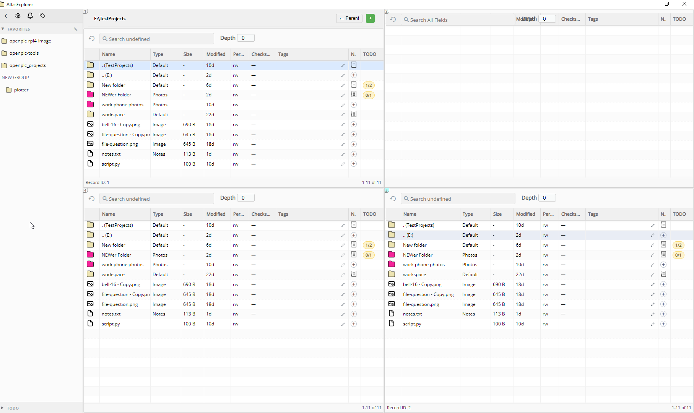

# Atlas Explorer

I'm making this because I'm just not satisfied with the user experience of File Explorer on Windows. There's some alternatives I've tried, and while they do bring extra features, none of them are appealing enough to ditch the default explorer.exe

This is an app that aims to provide its user maximal utility and transparency into their files. Categories, Tags, and Custom Attributes being the primary driver of utility. 

Philosophy:
* Control over everything. I'd rather be able to shoot myself in the foot than not be able to do something.
* Keep it ussable and useful, the app should make me want to use it.
* Keep it unopinionated, I should be able to use the app as little or as much as I want.
* Keep it fast, 200ms IS noticeable - not that this is a hard limit, but this should inform all design choices.
* Hotkeys are good
* Panels > Tabs - tabs make sense for a web browser, but when Win 11 added them I just found them less convenient than multiple windows.

## Features:

* Categorizable folders
* Notes (markdown supported)
* Tags
* Checksum monitoring
* Generates audit trail as you browse
* Background monitoring rules
* Alerts w/ rules
* Built in terminal
* Customizable context menu actions for launching scripts

### BUGS:
[x] If I set an alert to ANY/ANY - File Added. I get alerts when I first browse a folder. INITIAL events should always be considered a separate thing
[ ] Galery View
  [ ] the parent (..) folder shows the incorrect styling, seeing current folder style instead of parent style
  [ ] Not seeing the toolbar (no search or refresh) on the gallery view (should gallery view have a depth feature?)
[ ]  - panels 2 - 4 formatting oddly wrong. no titles, panel 2 has some kind of overlap issue. May as well remove the extra new tab (+) button on panel 2

### ROADMAP:
[ ] Rework the title/toolbar, maybe the new panel button should be on the left? Need a back button for sure and the parent button is a bit awkwardly placed.
[ ] CTRL+L to change path. Maybe CTRL+SHIFT+L opens a special segmented path edit?
[ ] Search and Filter, make it so that if I start typing it will start searching by name automatically.
[ ] Update navigation ber
[x] Filter options on each column header - I think this will need to be custom, I don't really see it in the w2ui library. NOTE: I think a key difference between filter and search is that search should always be recursive - possibly searching contents although only certain filetypes maybe?
[ ] BACKBURNER Make directory layout (columns shown, column sizes, depth) retained. I think have default per category would be good but maybe also need
[-] CTRL + Enter to do same as double click in grid --- nvm, change this:
  [ ] Enter browses dirs in same folders, opens Item Properties in modal for files
  [x] Ctrl+Enter does the same in a new panel
[x] (mostly done, maybe some missed but seems okay) Add some passive ui notifications (https://w2ui.com/web/demos/#/utils/8) for when settings are saved, this includes:
  * Browser Settings
  * Alerts and Monitoring Settings
  * Maybe others? Any time one of the "gridded" settings are updated such as Categories and Tabs
[x] Update the color inputs to use the w2ui color picker (https://w2ui.com/web/demos/#/fields/8)
[x] (got the color picker, not sure others are used but meh) Update the forms to use more of the standard w2ui elements, see: https://w2ui.com/web/demos/#/form
[x] Update the forms to not throw alert popups but instead use inline styling and remarks like a modern webform
[x] Add option on custom attributes for "copyable" which adds a copy button in the grid to copy its value to clipboard
[ ] Add a "pin" to Item Properties that prevents it from updating to the selected item
* I think that instead of having checksum be a straight option on categories it should be moved to Alerts and Monitoring where it obeys rules based on category + tags
* Forced manual assignment should not change the directory category unless there is an auto-assigned category. Currently goes back to Default (or maybe previously assigned category?)
* Would it be possible to have a global hotkey (fires even without focus) that opens an always-on-top popup which offers a list of every path of all currently open directories and all favorites?
[ ] LOCAL FAVORITES - instead of links, the user can populate local favorites. I'm thinking this should be in notes.txt - possibly without any special directive but anything that is a valid path gets shown in the sidebar when the user is browsing that dir.
[x] TODOs in notes get aggregated
[ ] Copy as Path in context menu (there is a perfect demo for this: https://w2ui.com/web/demos/#/grid/36)
[-] Tags in notes (and monaco autocomplete)
  [ ] Doesn't seem like these get promoted to the item, perhaps this broke at some point?
  [ ] Make some kind of connection where a tag that came from notes will point the user to the notes mentioning it
[ ] Autotagging rules - need some kind of confirmation pattern for this
[ ] One-click Backups
[ ] Diffing between files
[ ] Icons for context menu
[x] Photo / Media mode per category - thumbnails and preview pane
[x] Fix / figure out what to do with link in markdown (web links open in Electron)
[ ] Historical snapshot viewer
[x] Option for "Active Monitoring", taking combination of category, tags, and attributes
[x] Notes column change - when there are no notes for a file or dir the notes column offers a "+" icon that opens a notes modal already in edit mode.
[x] Tags column - add "+" icon to quickly add new tags to the item
[x] Add a Select All button on the Alerts Summary (to help with the Acknowledge feature)
[x] Update markdown viewer to consider a single line break as a newline - keep double line breaks as a newline with additional line height (new 
 object perhaps?) - turns out this was a built in option of markdown-it
[x] Alerts:
  [x] User can define what files / folders create alerts in a similar way (combo of category, tags, and attributes)
[x] Fewer alerts. Currently the "All browser settings saved successfully" alert is annoying, things like this should just show some text stating the same, alerts should be reserved for errors only.
[x] Item landing page is an item summary for the item selected in the grid
  [x] Currently locked to panel 1 - make it so it obeys the panel with focus - does nothing if landing page is selected - maybe does if file editor selected?
[x] Heighten the grid text wrappers, "g" for example is getting cut off at the bottom
[x] Context menu cancel with click off (left click)
[x] Collapsible Sidebar - all the stuff hides, should just show icons
[x] Category inheritance (Set rules like "all subdirs get X category" on category definition)
[x] Filetype profiles (icon and editability)
[x] exif data
[ ] exif GPS data aggregated to map

Manipulation phase:
* NOTE: Important here that changes made in the app don't trigger alerts (perhaps option to include?)
[ ] Dragon Dropping
[ ] CTRL+SHIFT+N for New Folder, user enters name in a modal popup, not inline
* How deep to go on file editing and viewing stuff? A lot can be done with monaco for plaintext files. But do we want to read spreadsheets as well? Perhaps View only for those?

### Off-the-wall stuff for the future:
I think these are decent ideas but should only be considered as add-ins once the app is mature
[ ] Integrate GrapesJS for "dashboards" functionality
  [ ] Ability to define layouts where files are displayed in custom arrangement
  [ ] ^ incl' ability to make "reports" of what files are missing from paths
[ ] Integrate Node-RED for "macros" functionality
  [ ] Automatically perform operations on file scan
  [ ] Customize the right click menu
  [ ] Exposure in Settings menu (to configure user's flows)

### Security notes:
[ ] Need to ensure ALL http requests from the frontend are blocked. We do not need internet functionality on this file explorer
[ ] Do we need to use dompurify (isomorphic-dompurify)? Consider once all the frontend utilities are in place as a sanitization step.
  *  tags are safe, need to audit anything that gets appended to the DOM manually
  * markdown disallows html, need to ensure it stays this way